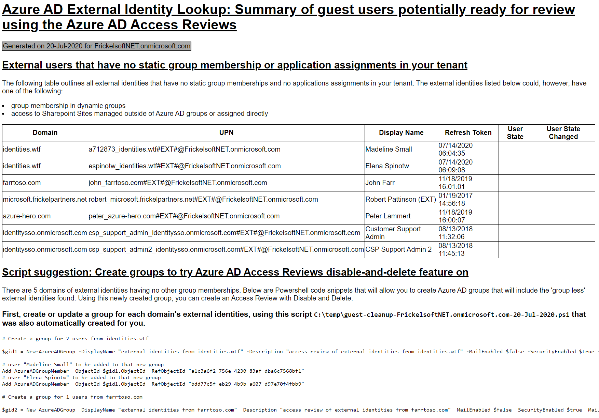

# Gathering information around external identity proliferation (for Access Reviews Disable-and-Delete)
## Synopsis

This Powershell sample script is meant to create a high-level overview over external identity use in a tenant, outlining if and where external identities are used:
* group membership
* application assignment
* assignment to privileged roles
* membership through rules in a dynamic group

The script is enumerating membership and assignments in Azure AD. It does not reach out to services that keep membership or role assignments outside of Azure AD (e.g. Sharepoint Online with direct user-to-role assignment outside of group membership).

This script has two file outputs, once executed correctly:
1. an HTM file that outlines found external identities, their home domains and where they were assigned permissions and group membership in the tenant
2. a Powershell PS1 script file that allows creating new Azure AD groups to collect and group external identities for an Access Review.

This Powershell script can be used to get an overview of external identities that do not have any assignments in groups or applications any more, hence, should be reviewed via Access Reviews for disable&delete from the tenant.

## How to use this script and its output

This sample script intends to assist Administrators and Compliance Auditors in organizations that use Azure AD for Business-to-Business (B2B) collaobration in finding, reviewing and - should need be - clean up external identity references from their Azure AD. As with internal users and employees - you want to ensure when collaborating with external partners, vendors and supplies that 

> the right people have the right access at the right time.

This script is the first step in discovering the use of external identities in your Azure AD tenant. It outlines where external identities are used and where external identities with potentially no permissions to resources exist, that can be cleaned up. Using the HTM output report and the PS1 script file, administrators will gain better clarity about the use of external identities in their tenant and can, based on the report, plan next steps to group (using the PS1 script) and review (using Azure AD Access Reviews) and re-attest continued need for external identities in the tenant.

This script drives awareness of external identities and prepares administrators to be able to plan their Access Reviews deployment and setup, to review external identities' access, as well as the need for continued presence for external identities in their tenant.

[Azure AD - Access Reviews](https://docs.microsoft.com/en-us/azure/active-directory/governance/access-reviews-overview)
[Azure AD - Identity Governance](https://docs.microsoft.com/en-us/azure/active-directory/governance/identity-governance-overview)
[Azure AD - External Collaboration](https://docs.microsoft.com/en-us/azure/active-directory/b2b/what-is-b2b)


The HTM output this script generates outlines found external identities in the tenant and their use:




## Prerequisites
This Powershell module runs in user context, which requires that the user account you run this with has privileges to read the directory.

## Exported functions
The script will run in the context of the executing user. An Azure AD user with reading permissions on the directory for users, groups, apps and roles is sufficient. The script, once started, will pop-up an Azure AD Sign-In dialog to sign-in into Azure AD.
```Powershell
.\external-identity-enumeration-JUL2020.PS1 -filePath C:\temp
```


[-filePath] to define the path the two output files (HTM and PS1) are created in. Use with a full path, such as:

```Powershell
.\external-identity-enumeration-JUL2020.PS1 -filePath C:\temp

.\external-identity-enumeration-JUL2020.PS1 -filePath "C:\users\jennifer\Downloads\script files"
```


