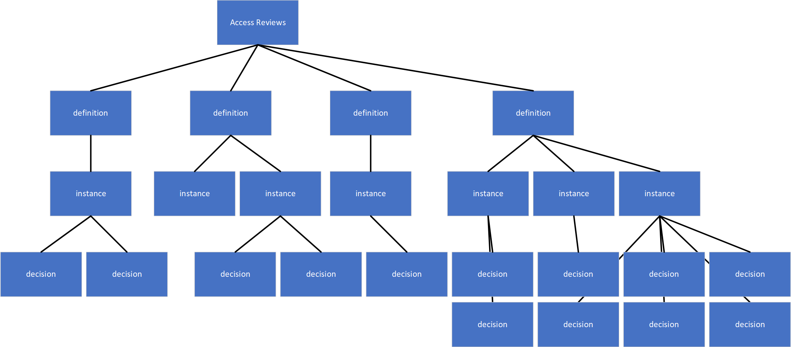

# Powershell code samples for the refreshed Access Reviews Graph API
## Synopsis

This Powershell sample script is meant to describe the ways the refreshed Access Reviews Graph API can be used to
* get access to Access Reviews defintions
* query the status of an Access Review (definition or instance)
* get instances of Access Reviews
* get decisions that were made by reviewers for their Access Reviews

programmatically.

The Access Reviews API on Microsoft Graph is described here: [Access Reviews - Graph API](https://docs.microsoft.com/en-us/graph/api/resources/accessreviewsv2-root?view=graph-rest-beta).

## Prerequisites
This Powershell module runs in an application context, which requires that you create an application registration in Azure AD for this script, and admin-consent for the required permissions for Microsoft Graph.

The steps are as follows:
1. Log into the Azure portal as a global administrator.
2. In the Azure portal, go to Azure Active Directory, and then click App registrations on the left.
3. Click New registration. Give your app a name, and then click Register.
4. Copy and save for later the application (client) ID that appears after the app is registered.
5. On the left, click API permissions.
6. Click "Add a permission", click "Microsoft Graph", and then click "Application permissions".
7. In the Select permissions list, select the following permissions: AccessReview.Read.All
8. Click Add permissions.
9. Click to Grant admin consent for <your tenant> and then click Yes. The status for each permission the app needs should change to a green checkmark, indicating consent was granted.
10. On the left, click Certificates & secrets.
11. Click New client secret and then for Expires select an expiry date that's a month away in the future. This will allow you to test sensibly, but not infinitely keep the credentials/secret valid. Click Add.
12. Copy and save locally the value of the secret that appears- you won’t see it again after you leave this part of the UI.

## Understading the Access Reviews API

The API to access Access Reviews structures information logically, such that customers and automation can query Graph as efficiently as possible. The API is comprised of three major building blocks:
* Access Reviews schedule definitions – the logical “blue print” that contains the settings of an Access Review and its instances. The schedule definition schedules the recurring review instances, but does not represent a review.
* An Access Review instance – which represents ana recurrence of a review that has a scope, reviewers and a status. Instances can either be recurring reviews that happen every quarter or year, or they can be multiple reviews in the same context, such as “Review all Office 365 Groups with external identities” – every O365 groups will be represented as its own instance.
* Decision items recorded for a review – which represent a decision a reviewer made for a specific user, on a specific instance, including the time stamp and justification that went along with the decision.



## Exported functions

This sample module exports the following Azure AD functions:

### Get-AzureADARAllDefinitions

 .Synopsis
 
  Gets the definition for all Access Reviews, and displays their status, creation dates and creators.

 .Description
 
  Gets the definition for all Access Reviews, and displays their status, creation dates and creators. Will display 20 Access Reviews by default.

 .Parameter top
 
  The number of Access Reviews to return.

 .Example
 
   Get-AzureADARDefinition -top 15

### Get-AzureADARDefinition

.Synopsis

  Gets the definition (blueprint) of an Access Review and displays its status, creation date and creator.

 .Description
 
  Gets the definition of an Access Review and displays its status, creation date and creator.

 .Parameter definitionID
 
  The ID of an Access Review, as seen from the Azure AD Portal.

 .Example
 
   Get-AzureADARDefinition -definitionID "a66c337b-6344-4661-a41b-a04e492baa44"

### Get-AzureADARInstancesFromDefinition

 .Synopsis
 
  Gets the instances for an Access Review.

 .Description
 
  Gets the instances for an Access Review. An instance could be individual reviews in a series or many reviews under one defintiion, such as "All O365 Groups with external identities".

 .Parameter top
 
  The number of Access Reviews to 

 .Example
 
   Get-AzureADARDefinition -definitionID "a66c337b-6344-4661-a41b-a04e492baa44"

### Get-AzureADInstanceDetails

 .Synopsis
 
  Gets the instance details for an instance of an Access Review.

 .Description
 
  Gets the details of an instance of an Access Review. Details include the status and the results of the instance.

 .Parameter definitionID
 
  The definition ID for the Access Review as seen from the Azure AD Portal.

 .Parameter instanceID
 
  The instanceID for an Access Review that you are interested in inspecting deeply.

 .Example
 
   Get-AzureADARDefinition -definitionID "a66c337b-6344-4661-a41b-a04e492baa44" -instanceID "a66c337b-6344-4661-a41b-a04e492baa44"

### Get-AzureADDecisionsFromInstance

 .Synopsis
 
  Gets the decisions that reviews submitted for an Access Review instance.

 .Description
 
  Gets the decisions for an instance of an Access Review. Decision details include the decision taken, the reviewer and whent he review was recorded - and also what the system recommendation was.

 .Parameter definitionID
 
  The definition ID for the Access Review as seen from the Azure AD Portal.

 .Parameter instanceID
 
  The instanceID for an Access Review that you are interested in inspecting deeply.

 .Example
 
   Get-AzureADARDefinition -definitionID "a66c337b-6344-4661-a41b-a04e492baa44" -instanceID "a66c337b-6344-4661-a41b-a04e492baa44"
   
 
 ### Samples
 
 ```Powershell
 # Connect-AzureADMSARSample -ClientApplicationId "<clientID>" -ClientSecret "<client secret>" -TenantDomain "yourtenant.onmicrosoft.com"
 # Get-AzureADARAllDefinitions $_SampleInternalAuthNHeaders -top 6
 
 
definitionID                         displayName
------------                         -----------
608df9d0-1558-4f9e-899c-7b88aa964196 Review guest access across Microsoft 365 groups
384c0424-2946-47ed-9c3d-a7ba83627a16 Florian's Graph-initiated review (Group review for external identities)
b3a028bd-f01f-419e-b50f-4b0e18528a05 Jenny's review
9674ef14-cb5a-43e2-bfea-710de89e730b No owners review
07b34c8d-467a-4905-b5e7-714d40c75b1a Review of external identities that have not signed in a long time      
4cbc9f92-4366-4bd0-91d8-7568473e0d4a Review of external identities that have never signed in.


# Get-AzureADARInstancesFromDefinition $_SampleInternalAuthNHeaders "608df9d0-1558-4f9e-899c-7b88aa964196"

definitionID                         instanceID                           status     authHeaders
------------                         ----------                           ------     -----------
608df9d0-1558-4f9e-899c-7b88aa964196 de0f0323-0a33-4437-8427-14b3238c041e InProgress {Authorization, Content-Type, ExpiresOn}
608df9d0-1558-4f9e-899c-7b88aa964196 1e2fcd2f-ec3a-4db5-a193-f9bcef93a34b InProgress {Authorization, Content-Type, ExpiresOn}
608df9d0-1558-4f9e-899c-7b88aa964196 c42dcd66-c57f-4c7c-9399-a76c6d644e11 InProgress {Authorization, Content-Type, ExpiresOn}
```


 
