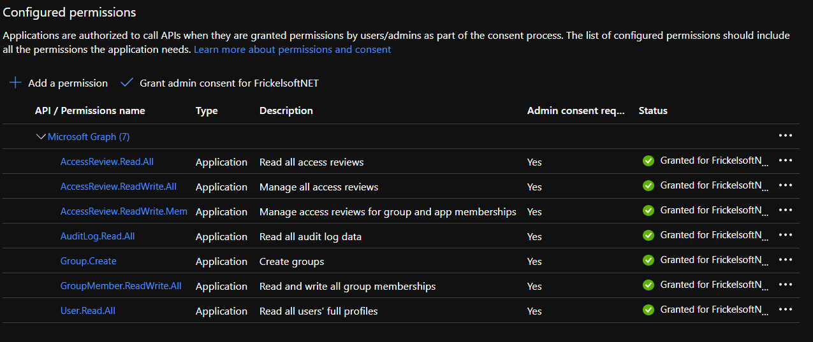

# Finding and reviewing external identities ("B2B Guests") that have never signed into your tenant, or have signed in to your tenant a long time ago
## Synopsis

This Powershell sample script is meant to enumerate the external identities in your tenant and check when their lastSignInDateTime was. When external identities have never signed in to your tenant, or have signed in a long time ago, the script can also:
* put the external identities that it found into a security group that it creates, add them as members 
* create an Access Review for that group, and request the external identities to self-attest that they still need access.

This script has two files:
1. PS1 file that is the main script. All logic is in this script file.
2. A JSON text file that contains the description for an Access Review. The script uses this JSON file to create Access Review with the settings defined in the JSON, so that the right review settings are applied.

This Powershell script can be used to get an overview of external identities that do have not come back in a while, hence, should be reviewed via Access Reviews for disable&delete from the tenant.

The script automates a few steps that - previously - needed to happen in multiple, partially manual, steps. An overview how you can think of this script is outlined in the following picture:


## How to use this script and its output

This sample script intends to assist Administrators and Compliance Auditors in organizations that use Azure AD for Business-to-Business (B2B) collaobration in finding, reviewing and - should need be - clean up external identity references from their Azure AD. As with internal users and employees - you want to ensure when collaborating with external partners, vendors and supplies that 

> the right people have the right access at the right time.

This script is the first step in discovering external identities in your Azure AD tenant. It outlines what external identities in your tenant exist and when if they have not signed in recently.

This script drives awareness of external identities and prepares administrators to be able to plan their Access Reviews deployment and setup, to review external identities' access, as well as the need for continued presence for external identities in their tenant.

Learn more:

[Azure AD - Access Reviews](https://docs.microsoft.com/en-us/azure/active-directory/governance/access-reviews-overview)

[Azure AD - Identity Governance](https://docs.microsoft.com/en-us/azure/active-directory/governance/identity-governance-overview)

[Azure AD - External Collaboration](https://docs.microsoft.com/en-us/azure/active-directory/b2b/what-is-b2b)

## Prerequisites and starting the script
This Powershell module runs in application context, which requires that a Service Principal is created in Azure AD that has a clientID (application ID) and a client secret. 

The script can perform three actions for you - and you can decide whether you want any of the actions to be performed:
* Go through the tenant and enumerate all external identities and find out if they ever signed in to the tenant, or if their last signin date is far in the past
* The external identities found that never signed in or whose sign in date is far in the past, can be added as members to two groups that the script creates
* The script creates two Access Reviews automatically for the two groups it just created.

Therefore, depending on which steps you want the script to undertake, you need to add the following Microsoft Graph OAuth2 scopes to the Service Principal that the script uses:
* Users.Read.All - to read external identity user accounts.
* AuditLog.Read.All - to read the lastSignInDateTime for the external identities. That information is not stored as part of the user object, but in the audit log portions in Azure AD.
* Organization.Read.All - to read the organization details - also required for the lastSignInDateTime to be readable.
* Group.Create - to create the two security groups to add stale external identities as members.
* GroupMember.ReadWrite.All - to add the stale external identities as members.
* AccessReview.Read.All - to create the Access Review
* AccessReview.ReadWrite.Membership - to create the Access Review

Also, please make sure you admin-consent to the Microsoft Graph scopes. The script uses the Access Reviews API V2.



The clientID and the client secret must be supplied in last two lines of the script, alongside your tenant name:
```Powershell
Connect-AzureADMSARSample -ClientApplicationId "<applicationID>" -ClientSecret "<clientSecret>" -TenantDomain "yourtenant.onmicrosoft.com"
```
The last two lines in the script are (a) there to connect to Azure AD and acquire an access_token for making Microsoft Graph calls, as well as (b) start the script with the relevant parameters.

If you want to download the script and gather information, download the script file, as well as the .CSS style file, to format your tenant-specific output:
* CreateJSON.JSON
* review-stale-externals-OCT2020.ps1

## Exported functions
The script will run in the context of the Service Principal you have created (application context) and could therefore be used to run "headless", as a scheduled script or task that runs just like a scheduled tasks, every three months.

You can either modify the PS1 script file, such that it contains all relevant information about client ID, client secret and the parameters you want to call the script with, or you comment out the last two lines, run the script, and call the relevent functions yourself:

After modifying the script:
```Powershell
.\review-stale-externals-OCT2020.PS1
```

Or commenting out the last two lines and then calling the methods manually:
```Powershell
.\review-stale-externals-OCT2020.PS1
Connect-AzureADMSARSample -ClientApplicationId "<applicationID>" -ClientSecret "<clientSecret>" -TenantDomain "yourtenant.onmicrosoft.com"
Find-AzureADStaleExternals $_SampleInternalAuthNHeaders $staleDays 60 -createReviewGroups $true -scheduleReviews $true -JSONPath "C:\temp\CreateJSON.json"
```

## Supported parameters:

[-staleDays] to define the maximum number of days that external identities can be "stale" with not having signed into your tenant, before the script catches them.

[-createReviewGroups] indicates with $true or $false whether the script should - in case it found external identities - create two security groups and add the found external identities as members:
* A group with displayName REVIEW_GUESTS_NOT_SIGNED_IN_LAST_XX_DAYS_<date> will be created with all external identities as members that have not signed in the last XX days.
* A group with displayName REVIEW_GUESTS_NEVER_SIGNED_IN_<date> will be created with all external identities as members that have NEVER signed in to your tenant.

[-scheduleReviews] indicates with $true or $false whether the script should - in case it found external identities - create an Access Review for the two security groups. The Access Review will have the settings as outlined in the JSON template file.

[-JSONPath] indicates the literal (exact) path where to find the .JSON file that outlines the settings for the Access Reviews that will be scheduled.

## Access Reviews that are scheduled
The template JSON file that you can download alongside the script has a definition of how Access Reviews for "stale" external identities will be scheduled. The template has pre-defined settings - but clearly, you can adjust the JSON template file according to your needs. The downloadable JSON file from here has the following settings:

* One-Time Access Review
* Reviews Guest Identity only
* Starts the review immediately (Start Date: Today)
* The external identities perform a self-review - there is no pre-defined reviewer. All external identities will be emailed and asked to attest if they still need access to the tenant.
* In case they come back and say they still need access to the tenant, they must provide a business justification.
* [Optional] External Identities that do NOT come back or come back and say they don't need access any more are blocked from signing in to your tenant and removed after 30 days ("Disable and Delete" feature in Azure AD Access Reviews). You can enable automatic blocking and deleting external identities, by changing the following line in the ARtemplate.JSON, before running the script:
Before:
```Powershell
"autoApplyDecisionsEnabled": false,
```
Change to:
```Powershell
"autoApplyDecisionsEnabled": true,
```
